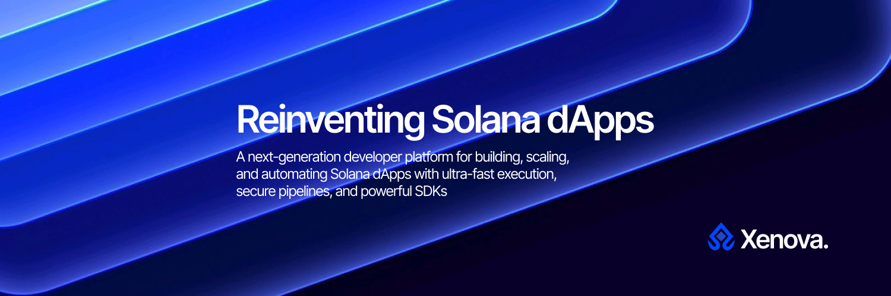

# Xenova SDK Monorepo



Monorepo for Xenova — a TypeScript-first SDK, an off-chain engine, CLI tools, and example apps for building DApps on Solana.

Purpose: provide a developer-first toolkit for building, automating, and running Solana integrations with emphasis on security, strong typing, and developer experience (DX).

---

**Overview**
- **TypeScript SDK**: `@xenova/sdk` — typed transaction builders, signer adapters, retry/backoff utilities, and job automation API.
- **Engine**: `@xenova/engine` — off-chain runtime that executes jobs, emits webhooks, and processes events.
- **CLI**: `@xenova/cli` — developer CLI for project bootstrap, job management, and local engine control.
- **Protocol & Common**: `@xenova/protocol`, `@xenova/common` — shared types, schemas, and utility functions.
- **Apps**: example apps at `apps/example-dapp` and `apps/docs-site` (Docusaurus + typedoc).

---

**Key Features**
- Typed SDK with transaction builders for common on-chain operations (transfer, program calls).
- Signer adapters (Phantom, Solflare, raw private key) and an abstraction layer for plug-in wallets.
- Reliable RPC utilities: retry, exponential backoff, and queueing to handle rate limits.
- Automation jobs: declarative job definitions, triggers, and action runners.
- Engine features: worker pool, persistent job store (demo: SQLite/Postgres), rate limiting, and webhook sender with retries.
- Monorepo uses `pnpm` workspaces for consistent builds, tests, and linting.

---

**Quickstart (local development)**

1. Install dependencies and bootstrap the workspace:

```powershell
pnpm -w install
pnpm -w build
```

2. Run the example dApp (development):

```powershell
pnpm --filter example-dapp dev
```

3. Run the engine locally (development):

```powershell
pnpm --filter @xenova/engine dev
```

---

**SDK usage example**

Short example using `@xenova/sdk` (minimal stub):

```ts
import { Xenova } from '@xenova/sdk';

async function main() {
	const client = new Xenova({ network: 'devnet', rpc: process.env.SOLANA_RPC });

	// Build and send a transfer transaction (stubbed)
	const tx = await client.transaction.transfer({ from: 'WALLET_PUBKEY', to: 'RECEIVER_PUBKEY', amount: 1_000_000 });
	const result = await tx.send();
	console.log('signature=', result.signature);

	// Create an automation job
	const job = await client.jobs.create({
		name: 'auto-swap',
		trigger: { event: 'onPriceDrop', token: 'SOL' },
		actions: [{ type: 'swap', poolId: '...' }]
	});
	console.log('job created', job);
}

main();
```

> Note: The full SDK implementation provides signing flows, RPC send/confirm, and end-to-end type-safety.

---

**Monorepo layout (brief)**

```
/
├─ packages/
│  ├─ sdk/        # @xenova/sdk (TypeScript)
│  ├─ engine/     # @xenova/engine (Node runtime)
│  ├─ cli/        # @xenova/cli (developer CLI)
│  ├─ protocol/   # @xenova/protocol (shared types)
│  └─ common/     # @xenova/common (utilities)
├─ apps/
│  ├─ example-dapp/
│  └─ docs-site/
├─ infra/
└─ .github/
```

---

**Scripts & Development**
- `pnpm -w install` — install workspace dependencies.
- `pnpm -w build` — build all packages (using `tsup`).
- `pnpm -w test` — run tests across the workspace (`vitest`).
- `pnpm -w lint` — run linter for all packages.

Use pnpm filters when working on a single package:

```powershell
pnpm --filter @xenova/sdk dev
pnpm --filter @xenova/engine dev
```

---

**CI & Releases**
- GitHub Actions workflow is available at `.github/workflows/ci.yml` and runs build, tests, and lint on push/PR.
- For releases, consider `changesets` or `semantic-release` to automate versioning and changelogs.

---

**Security & Best Practices**
- Never commit private keys to the repository; use environment variables or a secret manager.
- Respect RPC rate limits; prefer retry and exponential backoff utilities provided by the SDK.
- Test and review all on-chain integrations on `devnet` (or testnet) before running on mainnet.

---

**Contributing**
- See `CONTRIBUTING.md` for branch and PR guidelines.
- Use conventional commits for changelog automation.

---

**License & Contact**
- License: see `LICENSE`.
- Questions / PRs: open an issue or pull request on the GitHub repository. 
